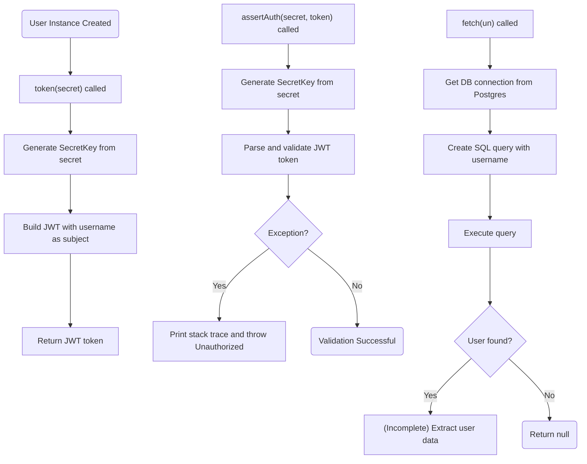
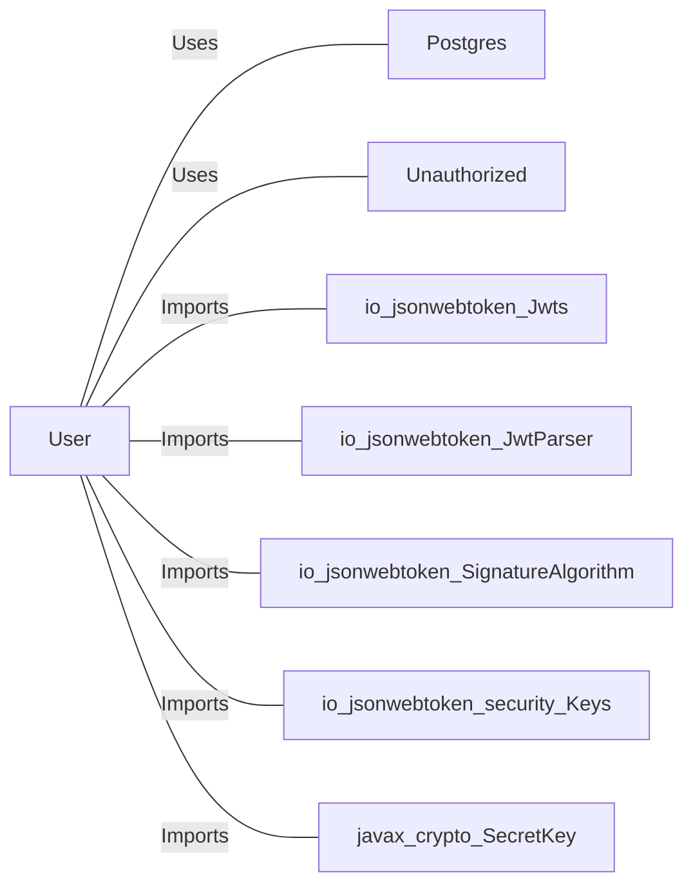

# User.java: User Authentication and JWT Management

## Overview

This class represents a user entity with authentication capabilities, including JWT token generation and validation. It also provides a method to fetch user data from a PostgreSQL database.

## Process Flow

## Insights

- The class combines user data representation with authentication logic.
- JWT tokens are generated using the username as the subject and a provided secret.
- Token validation throws a custom `Unauthorized` exception on failure.
- The `fetch` method is incomplete and vulnerable to SQL injection.
- The class depends on an external `Postgres` class for database connections and a custom `Unauthorized` exception.

## Vulnerabilities

- **SQL Injection**: The `fetch` method concatenates user input directly into the SQL query, making it vulnerable to SQL injection attacks.
- **Incomplete Implementation**: The `fetch` method is incomplete and does not properly extract user data from the `ResultSet`.
- **Exception Handling**: Catching generic `Exception` can obscure the root cause of errors and is not a best practice.
- **Hardcoded Algorithm**: The JWT generation uses a default algorithm without explicit specification, which may lead to future compatibility issues.

## Dependencies

- `Postgres` : Provides the `connection()` method for obtaining a database connection. Nature: Uses.
- `Unauthorized` : Custom exception thrown when authentication fails. Nature: Uses.
- `io.jsonwebtoken.Jwts`, `io.jsonwebtoken.JwtParser`, `io.jsonwebtoken.SignatureAlgorithm`, `io.jsonwebtoken.security.Keys`, `javax.crypto.SecretKey` : Used for JWT creation and validation. Nature: Imports.

## Data Manipulation (SQL)

| Attribute      | Type   | Description                |
|----------------|--------|----------------------------|
| id             | String | User identifier            |
| username       | String | Username                   |
| hashedPassword | String | Hashed user password       |

- `users`: SELECT operation to fetch user data by username. The query is vulnerable to SQL injection due to direct string concatenation.
