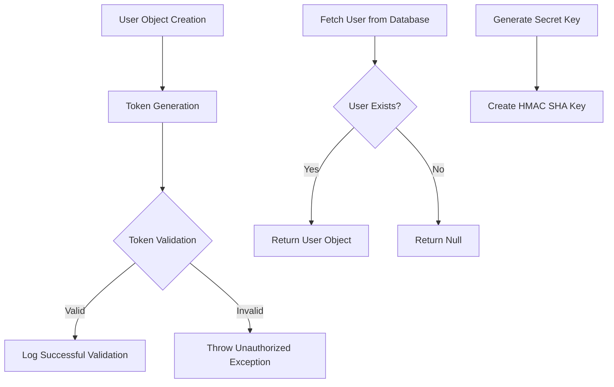
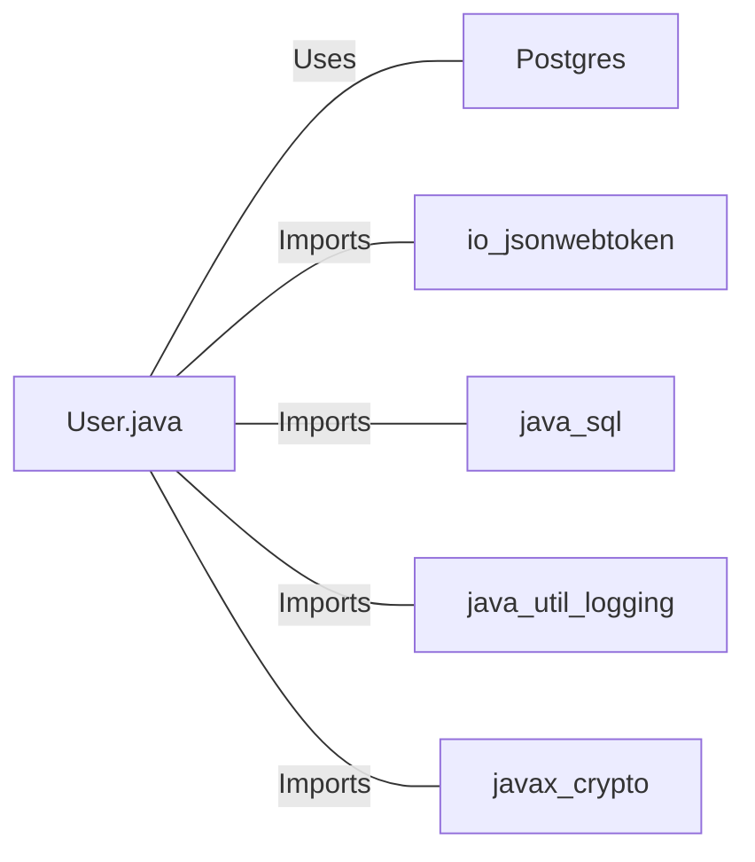

# User.java: User Authentication and Management System

## Overview

This Java class, `User`, is responsible for user authentication, token generation, and database operations related to user management. It includes methods for creating and validating JWT tokens, fetching user data from a database, and generating secret keys for token signing.

## Process Flow

## Insights

- The class uses JWT (JSON Web Tokens) for user authentication.
- User data is stored in a PostgreSQL database.
- The class implements logging for various operations and error handling.
- Password hashing is implied but not explicitly implemented in this class.
- The `fetch` method uses a prepared statement to prevent SQL injection.
- Token validation is done using a try-catch block to handle potential exceptions.

## Dependencies

- `Postgres`: Used for database connection management
- `io.jsonwebtoken`: Used for JWT token generation and parsing
- `java.sql`: Used for database operations (Connection, PreparedStatement, ResultSet)
- `java.util.logging`: Used for logging operations and errors
- `javax.crypto`: Used for cryptographic operations (SecretKey)

## Data Manipulation (SQL)

| Entity | Attributes | Data Type | Description |
|--------|------------|-----------|-------------|
| users  | user_id    | String    | Unique identifier for the user |
|        | username   | String    | User's username |
|        | password   | String    | User's hashed password |

- `users`: SELECT operation to fetch user data based on the username

## Vulnerabilities

1. **Insufficient Error Handling**: The `fetch` method throws a generic `RuntimeException` when an error occurs during database operations. This could potentially expose sensitive information in stack traces if not properly caught and handled in the calling code.

2. **Potential SQL Injection**: While the `fetch` method uses a prepared statement, which is generally safe against SQL injection, the construction of the query string is still done by string concatenation. It's a good practice, but care should be taken to ensure that the `username` parameter is properly sanitized before use.

3. **Weak Secret Key Generation**: The `generateKey` method uses the raw bytes of the secret string to generate the HMAC SHA key. This approach might not provide sufficient entropy for the key, especially if the secret is short or predictable. A more robust key derivation function should be used.

4. **Logging Sensitive Information**: The `assertAuth` method logs the username from the validated token. Depending on the logging configuration, this could potentially expose user information in log files.

5. **No Password Hashing Implementation**: While the class stores a `hashedPassword`, there's no method in this class to actually hash passwords. This could lead to storing plain text passwords if not properly implemented elsewhere.

6. **Token Expiration**: The JWT token generation doesn't include an expiration claim. This could lead to tokens that are valid indefinitely, which is a security risk.

7. **Exception Handling in Token Validation**: The `assertAuth` method catches all exceptions and throws a generic `Unauthorized` exception. This could mask specific issues (like token expiration) and make debugging more difficult.

8. **Potential Resource Leak**: In the `fetch` method, if an exception occurs after the `Connection` is created but before the `try-with-resources` block, the connection might not be properly closed.

These vulnerabilities should be addressed to improve the overall security and robustness of the application.
