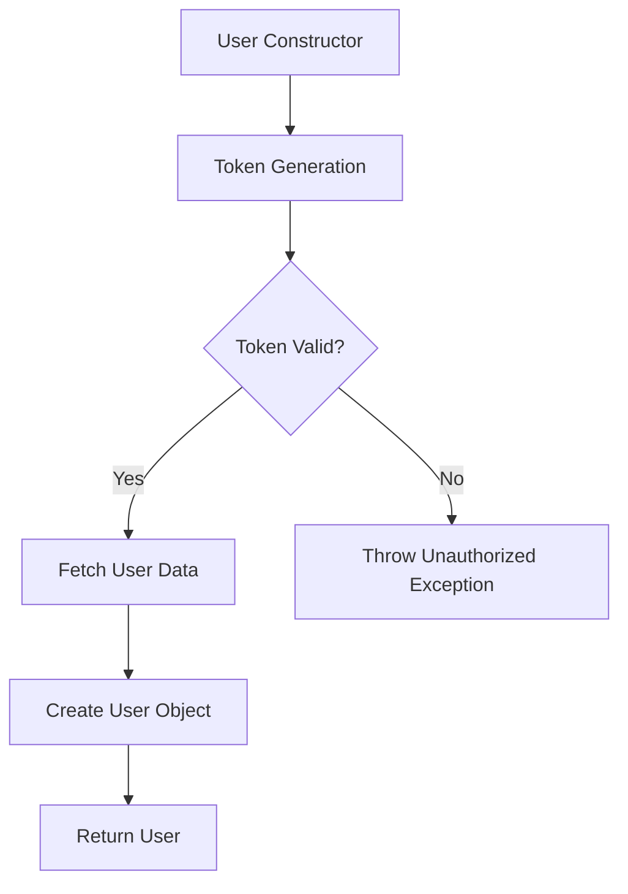
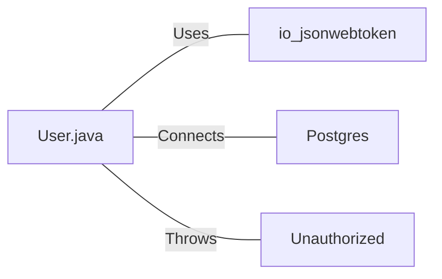

# User.java: User Authentication and Management

## Overview

This Java class, `User`, is responsible for user authentication, token generation, and database operations related to user management. It includes methods for creating user objects, generating and validating JWT tokens, and fetching user data from a PostgreSQL database.

## Process Flow

## Insights

- The class uses JWT (JSON Web Tokens) for user authentication.
- User data is stored in a PostgreSQL database.
- The `fetch` method uses a prepared statement to prevent SQL injection.
- Error handling is implemented for database operations and token validation.
- The class doesn't include methods for user registration or password hashing.

## Dependencies

- `io.jsonwebtoken`: Used for JWT token generation and validation
- `Postgres`: Custom class for database connection management
- `Unauthorized`: Custom exception class for authentication failures

## Data Manipulation (SQL)

| Entity | Description |
|--------|-------------|
| `users` | SELECT operation to fetch user data based on username |

Table structure for `users`:

| Column Name | Data Type | Description |
|-------------|-----------|-------------|
| user_id     | String    | Unique identifier for the user |
| username    | String    | User's username |
| password    | String    | User's hashed password |

## Vulnerabilities

1. **Insecure Secret Key Handling**: The `token` and `assertAuth` methods convert the secret string directly to bytes, which may lead to weak keys if the secret is not properly generated or managed.

2. **Exception Information Disclosure**: In the `assertAuth` method, the full exception message is thrown as part of the `Unauthorized` exception, which could potentially expose sensitive information.

3. **Lack of Connection Pooling**: The database connection is opened and closed for each `fetch` operation, which can be inefficient for high-traffic applications.

4. **Potential Resource Leak**: In the `fetch` method, the `PreparedStatement` is not explicitly closed, which could lead to resource leaks.

5. **Weak Error Handling**: The `fetch` method catches all exceptions and prints the stack trace, which may expose sensitive information in production environments.

6. **Lack of Input Validation**: There's no input validation for the username parameter in the `fetch` method, which could potentially lead to unexpected behavior or security issues.

7. **Returning Null User**: The `fetch` method returns `null` if no user is found, which could lead to null pointer exceptions if not handled properly by the calling code.

8. **Storing Passwords**: The `User` object stores the hashed password, which is generally not recommended. It's better to only store and compare hashed passwords when needed, not keep them in memory.
