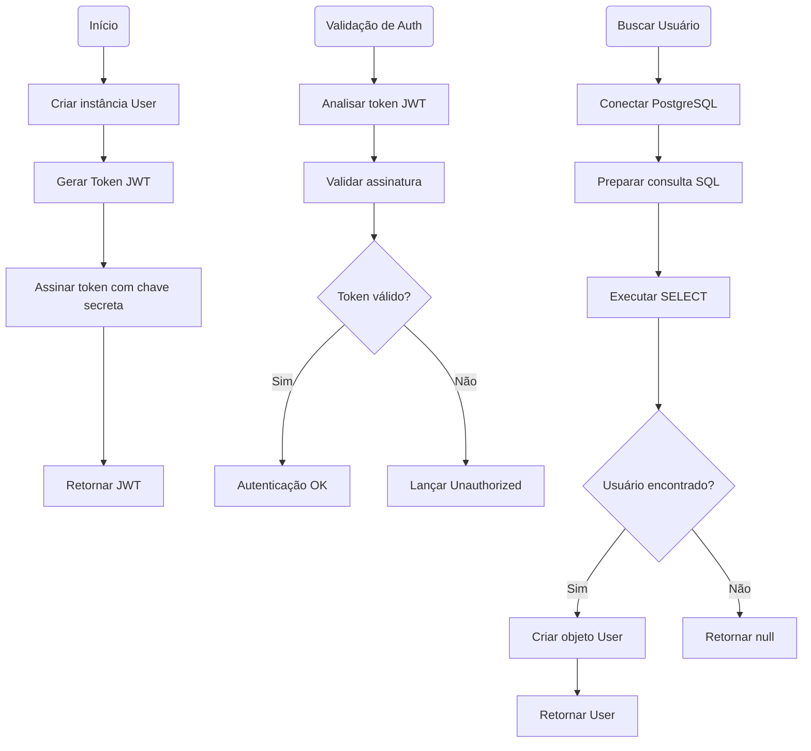
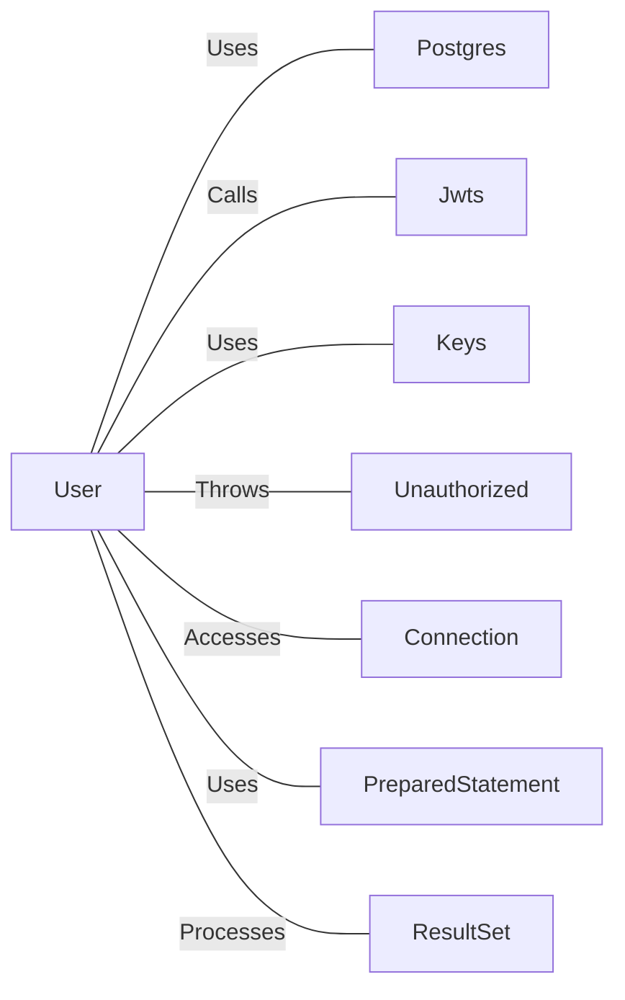

# User.java: Sistema de Autenticação e Gerenciamento de Usuários

## Overview

Esta classe implementa um sistema de autenticação de usuários utilizando JWT (JSON Web Tokens) e integração com banco de dados PostgreSQL. A classe é responsável por representar usuários, gerar tokens de autenticação, validar tokens e buscar informações de usuários no banco de dados.

## Process Flow

## Insights

- A classe utiliza JWT com algoritmo HS256 para autenticação baseada em tokens
- Implementa busca de usuários no banco de dados com prepared statements
- Armazena senhas em formato hash para segurança
- Utiliza conexão com PostgreSQL através da classe `Postgres`
- Método `assertAuth` valida tokens e lança exceção `Unauthorized` em caso de falha
- O método `fetch` é estático, permitindo busca de usuários sem instanciar a classe
- Tratamento de exceções SQL com impressão de stack trace para debug

## Dependencies

- `Postgres`: Classe para gerenciamento de conexões com banco de dados PostgreSQL
- `Jwts`: Biblioteca para criação e parsing de tokens JWT
- `Keys`: Utilitário para geração de chaves criptográficas
- `Unauthorized`: Exceção customizada para falhas de autenticação
- `Connection`: Interface JDBC para conexão com banco de dados
- `PreparedStatement`: Interface JDBC para execução de consultas preparadas
- `ResultSet`: Interface JDBC para processamento de resultados de consultas

## Data Manipulation (SQL)

| Tabela | Operação | Descrição |
|--------|----------|-----------|
| `users` | SELECT | Busca usuário por username com limite de 1 registro, retornando userid, username e password |

### Estrutura da Tabela users

| Campo | Tipo | Descrição |
|-------|------|-----------|
| userid | String | Identificador único do usuário |
| username | String | Nome de usuário para login |
| password | String | Senha do usuário em formato hash |

# Vulnerabilidades

## Vulnerabilidades de Segurança Identificadas

### 1. Exposição de Informações Sensíveis
- **Problema**: O método `assertAuth` imprime stack traces completos no console quando ocorrem exceções, potencialmente expondo informações sensíveis sobre a estrutura interna da aplicação
- **Impacto**: Vazamento de informações que podem ser utilizadas por atacantes
- **Recomendação**: Implementar logging seguro sem exposição de detalhes internos

### 2. Tratamento Inadequado de Exceções
- **Problema**: O método `fetch` imprime exceções SQL diretamente no console, incluindo detalhes da estrutura do banco de dados
- **Impacto**: Possível exposição de informações sobre o esquema do banco de dados
- **Recomendação**: Implementar logging estruturado e sanitizado

### 3. Gerenciamento de Recursos
- **Problema**: Não há fechamento explícito de recursos JDBC (Connection, PreparedStatement, ResultSet)
- **Impacto**: Possível vazamento de recursos e degradação de performance
- **Recomendação**: Utilizar try-with-resources ou implementar fechamento manual adequado

### 4. Validação de Entrada
- **Problema**: Não há validação dos parâmetros de entrada nos métodos públicos
- **Impacto**: Possibilidade de comportamento inesperado com entradas nulas ou inválidas
- **Recomendação**: Implementar validação de parâmetros de entrada

### 5. Configuração de Chave JWT
- **Problema**: A chave secreta para JWT é passada como parâmetro string, sem validação de força ou formato
- **Impacto**: Possível uso de chaves fracas que comprometem a segurança dos tokens
- **Recomendação**: Implementar validação de força da chave e usar configuração segura
