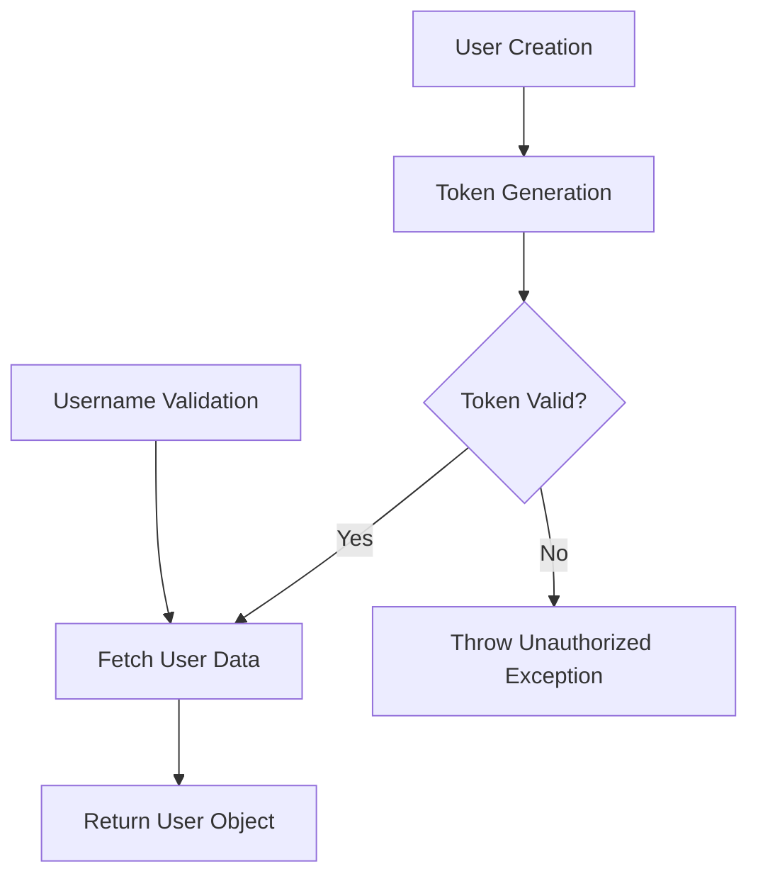
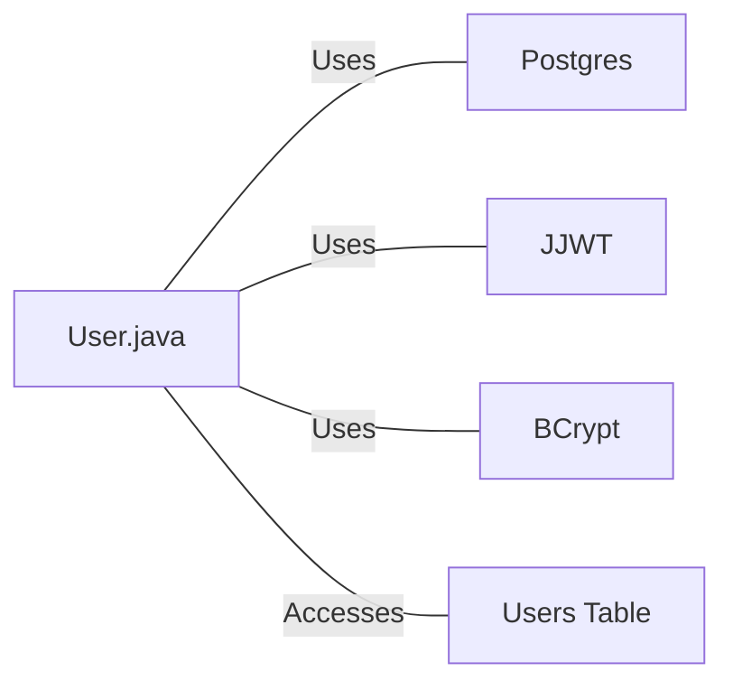

# User.java: User Authentication and Management

## Overview

This Java class, `User`, is responsible for user authentication, token generation, and database operations related to user management. It includes methods for creating users, generating authentication tokens, validating tokens, and fetching user data from a database.

## Process Flow

## Insights

- The class uses JWT (JSON Web Tokens) for authentication.
- BCrypt is used for password hashing, indicating secure password storage.
- User data is fetched from a PostgreSQL database.
- Username validation is implemented using regex to ensure security.
- The class handles exceptions and provides custom error messages.

## Dependencies

- `Postgres`: Used for database connection and operations
- `JJWT`: Used for JWT token generation and parsing
- `BCrypt`: Used for password hashing (imported but not directly used in the provided code)
- `users_table`: Database table accessed for user information

## Data Manipulation (SQL)

| Entity | Description |
|--------|-------------|
| `users` | SELECT operation to fetch user data based on username |

## Vulnerabilities

1. **Potential SQL Injection**: The `fetch` method uses a prepared statement, which is good practice. However, the error handling could be improved to prevent leaking sensitive information in case of database errors.

2. **Token Security**: The token generation uses HMAC-SHA, but the key size is not specified. It's important to ensure that the secret key used has sufficient entropy and length for security.

3. **Exception Handling**: The `assertAuth` method prints the full stack trace to `System.err`, which could potentially leak sensitive information in production environments.

4. **Password Handling**: While BCrypt is imported, it's not used in the provided code for password verification. Ensure that password comparison is done securely using BCrypt's `checkpw` method.

5. **Token Expiration**: The generated tokens don't have an expiration time, which could lead to security issues if tokens are compromised and remain valid indefinitely.

6. **Error Messages**: Some error messages include exception details, which could potentially expose sensitive information. It's better to use generic error messages in production.

7. **Resource Management**: The database connection in the `fetch` method is closed, but the `PreparedStatement` is not explicitly closed, which could lead to resource leaks.

8. **Input Validation**: While there is username validation, there's no validation for other inputs like the secret used for token generation.
