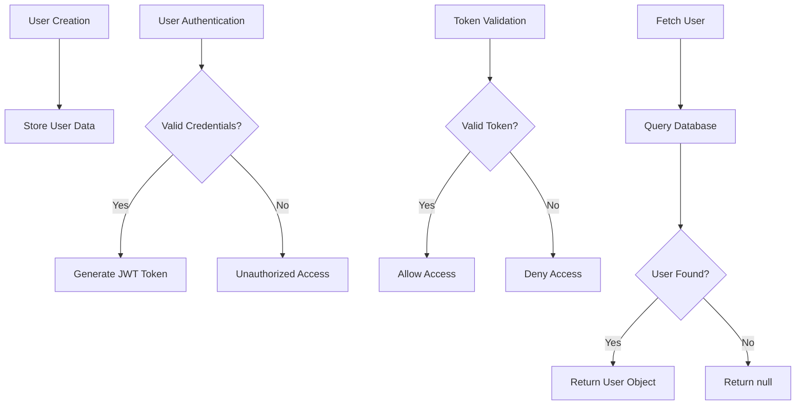
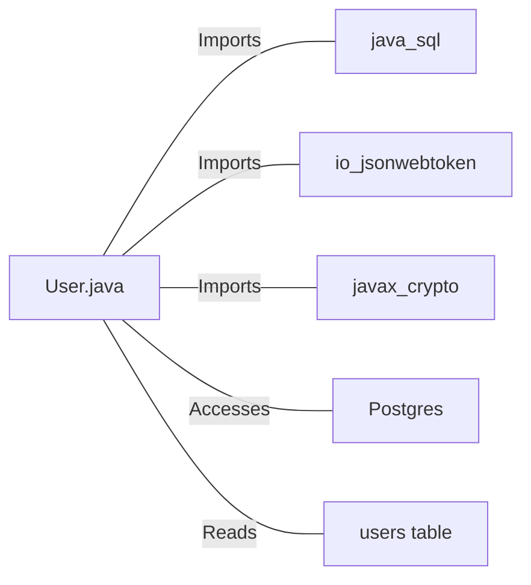

# User.java: User Authentication and Management System

## Overview

This Java class, `User`, is responsible for user authentication, token generation, and database operations related to user management. It includes methods for creating and validating JWT tokens, fetching user data from a database, and storing user information.

## Process Flow

## Insights

- Uses JWT (JSON Web Tokens) for authentication
- Implements token generation with expiration time (1 hour)
- Performs database operations to fetch user data
- Includes error handling and logging for database operations
- Enforces a minimum length for the secret key used in token generation and validation

## Dependencies

- `java.sql`: Used for database connections and operations
- `io.jsonwebtoken`: Utilized for JWT token generation and validation
- `javax.crypto`: Employed for cryptographic operations
- `Postgres`: Custom class for database connection (not shown in the provided code)
- `users table`: Database table storing user information

## Data Manipulation (SQL)

| Entity | Description |
|--------|-------------|
| `users` | SELECT operation to fetch user data based on username |

## Vulnerabilities

1. **Potential SQL Injection**: The `fetch` method uses a prepared statement, which is good practice. However, the query string is constructed using string concatenation, which could potentially lead to SQL injection if not properly sanitized elsewhere in the code.

2. **Weak Secret Key Handling**: While there's a check for the minimum length of the secret key (32 characters), the secret is passed as a string and converted to bytes. This approach might not be as secure as using a properly generated cryptographic key.

3. **Exception Handling in Token Validation**: The `assertAuth` method catches all exceptions and wraps them in an `Unauthorized` exception. This could potentially mask other types of errors and make debugging more difficult.

4. **Logging of Sensitive Information**: The error logging in the `fetch` method might log sensitive information if the SQL exception contains any. It's important to ensure that no sensitive data is logged.

5. **Password Storage**: The class stores hashed passwords, which is good. However, it's crucial to ensure that a strong, salted hashing algorithm is used (not visible in this code snippet).

6. **Token Expiration**: While the token has an expiration time, there's no mechanism shown for token revocation or refresh, which could be a security concern for long-lived sessions.

7. **Error Messages**: The error messages in the `assertAuth` method could potentially reveal too much information about the nature of the authentication failure, which could be exploited by attackers.
