# User.java: User Authentication and Management System

## Overview

This Java class, `User`, is responsible for user authentication, token generation, and database operations. It includes methods for secure password hashing, JWT token generation and validation, and database interactions.

## Process Flow

## Insights

- Uses JWT (JSON Web Tokens) for authentication
- Implements BCrypt for secure password hashing and verification
- Utilizes PreparedStatements to prevent SQL injection attacks
- Includes error handling for database operations and token validation
- Employs a secure random number generator for salt creation in password hashing

## Dependencies

```mermaid
graph LR
    User.java --- |"Uses"| Postgres
    User.java --- |"Uses"| BCrypt
    User.java --- |"Uses"| JJWT
    User.java --- |"Accesses"| users_table["users table"]
```

- `Postgres`: Used for database connection
- `BCrypt`: Utilized for password hashing and verification
- `JJWT`: Used for JWT token generation and validation
- `users table`: Database table accessed for user information

## Data Manipulation (SQL)

| Entity | Attributes | Type | Description |
|--------|------------|------|-------------|
| users  | user_id    | String | Unique identifier for the user |
|        | username   | String | User's username |
|        | password   | String | Hashed password of the user |

`users`: SELECT operation to fetch user details based on the username

## Vulnerabilities

1. **Insecure Secret Handling**: The `token` method uses a secret passed as a string parameter. This approach might lead to the secret being exposed if not properly managed. It's better to use environment variables or secure key management systems.

2. **Lack of Token Expiration**: The JWT tokens generated do not include an expiration time. This could lead to tokens being valid indefinitely, which is a security risk.

3. **Exception Handling in Database Operations**: The `fetch` method catches SQLException but doesn't handle specific database errors differently. This could lead to masking critical issues or exposing sensitive information in error messages.

4. **Connection Management**: The database connection is closed in the try block. It should be in a finally block to ensure it's always closed, even if an exception occurs.

5. **Potential Information Disclosure**: The error messages in `assertAuth` and `fetch` methods might reveal too much information about the system's internals. It's better to log detailed errors server-side and return generic error messages to the client.

6. **Lack of Input Validation**: There's no input validation for the username in the `fetch` method. While using PreparedStatement prevents SQL injection, it's still a good practice to validate and sanitize inputs.

7. **Hardcoded BCrypt Work Factor**: The `hashPassword` method uses a hardcoded work factor of 12. While this is generally good, it might be better to make this configurable to allow for future adjustments as computational power increases.
